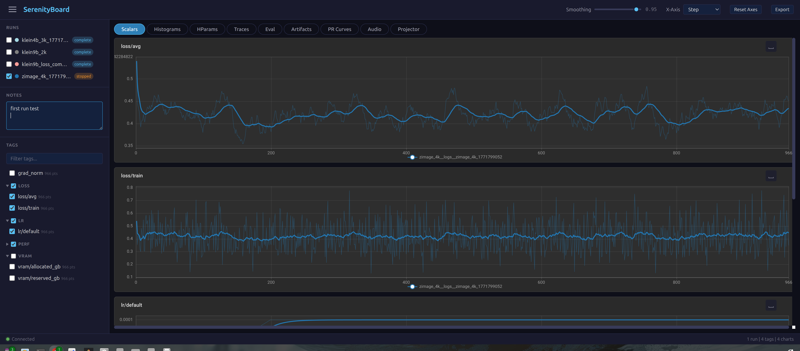

# SerenityBoard

A training dashboard that replaces TensorBoard. SQLite backend, zero config, live-updating charts.



## Install

```bash
pip install -e .
```

## Use with OneTrainer

SerenityBoard is a drop-in TensorBoard replacement. In OneTrainer's `GenericTrainer.py`, the import already falls back automatically:

```python
try:
    from serenityboard.compat.torch import SummaryWriter
except Exception:
    from torch.utils.tensorboard import SummaryWriter
```

If your OneTrainer doesn't have this yet, replace line 49 in `modules/trainer/GenericTrainer.py`:

```diff
- from torch.utils.tensorboard import SummaryWriter
+ try:
+     from serenityboard.compat.torch import SummaryWriter
+ except Exception:
+     from torch.utils.tensorboard import SummaryWriter
```

Then install SerenityBoard into the same venv as OneTrainer:

```bash
cd /path/to/SerenityBoard
pip install -e .
```

OneTrainer writes logs to `<workspace>/tensorboard/`. Point the dashboard at it:

```bash
serenityboard serve --logdir /path/to/workspace/tensorboard --port 6006
```

Open `http://localhost:6006`. Charts update live while training runs.

### What gets logged

OneTrainer automatically logs these scalars through the existing `self.tensorboard.add_scalar()` calls:

| Tag | Description |
|-----|-------------|
| `loss/train_step` | Per-step training loss |
| `smooth_loss/train_step` | EMA-smoothed loss |
| `lr/transformer` | Learning rate (name varies by model) |
| `loss/validation_step/{concept}` | Per-concept validation loss |
| `ema_decay` | EMA decay rate (if enabled) |

Plus sample images, histograms, and hparams if configured in OneTrainer.

### GPU metrics

SerenityBoard automatically logs GPU and system metrics when writing:

- `gpu/utilization`, `gpu/temperature`, `gpu/memory_used`, `gpu/memory_total`
- `system/cpu_percent`, `system/ram_used_gb`, `system/ram_total_gb`

Uses pynvml if available, falls back to nvidia-smi, then skips gracefully.

## Use standalone

```python
from serenityboard import SummaryWriter

with SummaryWriter(logdir="./runs", run_name="experiment_01",
                    hparams={"lr": 1e-4, "batch_size": 32}) as writer:
    for step in range(1000):
        writer.add_scalar("loss/train", loss, step)
        writer.add_scalar("lr", current_lr, step)
        if step % 100 == 0:
            writer.add_image("samples/latest", img_array, step)
```

```bash
serenityboard serve --logdir ./runs --port 6006
```

## Use as TensorBoard drop-in (any codebase)

```python
# from torch.utils.tensorboard import SummaryWriter
from serenityboard.compat.torch import SummaryWriter

# everything else stays the same
writer = SummaryWriter(log_dir="./runs")
writer.add_scalar("loss", 0.5, global_step=100)
```

## Features

- SQLite WAL backend -- no protobuf, concurrent reads/writes
- Async write pipeline -- non-blocking writes with background thread
- Live updates via WebSocket
- EMA smoothing with adjustable slider
- Multi-run comparison overlay
- CSV/JSON data export
- Run notes (per-run text annotations)
- Auto GPU/system metrics
- Recursive logdir scan (nested run directories)
- Dark theme, vanilla JS + ECharts frontend

### Tabs

Scalars, Histograms, HParams, Traces, Eval, Artifacts, PR Curves, Audio, Text, Graphs, Embeddings, Meshes

## Writer API

| Method | Description |
|--------|-------------|
| `add_scalar(tag, value, step)` | Log a scalar |
| `add_scalars(main_tag, {sub: val}, step)` | Log grouped scalars |
| `add_image(tag, img, step)` | Log image (numpy/PIL) |
| `add_images(tag, imgs, step)` | Log batch of images |
| `add_histogram(tag, values, step)` | Log distribution |
| `add_text(tag, text, step)` | Log text |
| `add_audio(tag, audio, step, sample_rate)` | Log audio |
| `add_hparams(hparam_dict, metric_dict)` | Log hyperparameters |
| `add_mesh(tag, vertices, step)` | Log 3D mesh |
| `add_pr_curve(tag, labels, predictions, step)` | Log PR curve |
| `flush()` | Block until committed |
| `close()` | Flush + shutdown |

## REST API

| Endpoint | Description |
|----------|-------------|
| `GET /api/runs` | List runs |
| `GET /api/runs/{run}/tags` | Tag discovery |
| `GET /api/runs/{run}/scalars?tag=...` | Scalar data |
| `GET /api/runs/{run}/export?format=csv` | Export CSV/JSON |
| `GET /api/runs/{run}/notes` | Get run notes |
| `PUT /api/runs/{run}/notes` | Save run notes |
| `GET /api/runs/{run}/images?tag=...` | Images |
| `GET /api/runs/{run}/blob/{key}` | Raw blob |
| `GET /api/compare/scalars?tag=...&runs=a,b` | Compare runs |
| `WS /ws/live` | Live updates |
| `DELETE /api/runs/{run}` | Delete a run |

MIT License
